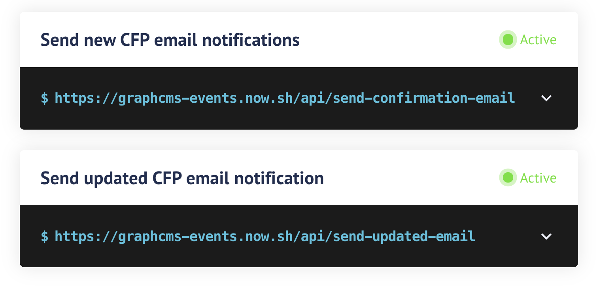

# GraphCMS Events

> Minimalist conference website built with GraphCMS, Next.js, Now and Postmark.

[Read more](https://graphcms.com/blog/managing-speakers-and-talk-submissions-with-the-serverless-stack/)

## The stack

When putting on an event with presenters, you have two halves to handle. Arranging the schedule, and collecting the presenters. There are a number of siloed tools for both, but none that are able to provide a truly "end-all-be-all" solution. So why not build your own?

- **[GraphCMS](https://graphcms.com)**: Manages the speakers, talks, track schedules, events and sponsors.
- **[Next.js](https://nextjs.org/)**: Acts as a powerful framework that lets us query for live data and use serverless functions in Now.
- **[Vercel](https://vercel.com/home)**: A static host that also supports Lambda functions where we handle our submissions and feedback hooks.
- **[Postmark](https://postmark.com)**: Sending notification emails for confirmation.

## How it works

1. GraphCMS will house our entire content architecture. We will discuss the architecture in further detail at the connected blog post. The rough structure (though not hierarchial) looks like this: Events -> (Sponsors | Tracks -> Time-Slots -> Talks -> Speakers)

2. Next.js will power our application where we fetch content from GraphCMS (through a GraphQL proxy that authenticates our GraphCMS endpoint, hosted locally in a lambda function).

3. The "Submit a Talk" function is handled server-side in a lambda, executed by now. This will create a talk submission that is entered into GraphCMS.

4. GraphCMS will kick off a Webhook on talk creation to another Now hosted endpoint that will send a confirmation email through Postmark to the speaker as well as a notification of a new talk to the organizer of the event.

5. In the email to the organizer, two links will be exposed where they can approve or reject the submission through endpoints again hosted in Now.

⚠️ You need to have an account and API keys for Postmark for this to work.

## How to use

If you wish to extend and work with this example locally, follow the instructions below.

If you'd rather check out a [demo](https://graphcms-events.vercel.app) or deploy to your own Now account, you can do that too.

First, you will need accounts at GraphCMS, Postmark and Now.

### 1. Download and install dependencies

```bash
git clone git@github.com:graphcms/graphcms-events.git
cd graphcms-events
yarn # npm install
cp .env.buld.sample .env.build
cp .env.sample .env
```

Install the [Vercel CLI](https://vercel.com/download)

### 2. Create your project on GraphCMS

You will need to [create a project from template](https://graphcms.com/docs/getting-started/start-from-scratch/#start-from-template) inside GraphCMS to carefully match what is expected from GraphCMS.

You'll need an account with GraphCMS. It's recommended you use separate API keys for development and production.

### 3. Setup development environment variables

**Env Vars**
Add the necessary variables to `.env` and `.env.build` files.

**Deployment URLS**
Add your own domain for the production version of your application in the `now.config.js` file at line 17.

⚠️ _You'll need to add your own domain for this step, and you will need to deploy to Now first to do that._

**Secrets**
Now keeps a strict wall of separation between your project `env` an your lambda `env` - called a `secret`. You can read more about them and the philosophy of separation as well as how to add them [here](https://vercel.com/docs/environment-variables)

You'll need to add the following secrets, which you should already have filled out in your `envs`.

```bash
website-graphcms-token
demo-graphcms-events-graphcms-token
demo-graphcms-events-graphcms-mutation-token
demo-graphcms-events-graphcms-endpoint
demo-graphcms-events-postmark-api-key
demo-graphcms-events-postmark-from-address
demo-graphcms-events-postmark-new-cfp-template-id
demo-graphcms-events-postmark-confirmed-template-id
demo-graphcms-events-postmark-accepted-template-id
demo-graphcms-events-postmark-rejected-template-id
demo-graphcms-events-new-cfp-email
```

### 4. Add Webhooks to your GraphCMS project



⚠️ _You'll need to add your own domain before the `api` path, and you will need to deploy to Now first to do that._

### 5. Run locally

Once all dependencies and environment variables are satisfied, you can run Next.js locally to build in development, including the API endpoints with `now`:

```bash
now dev
```
